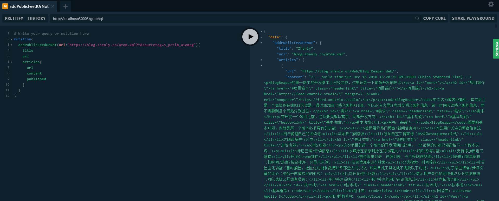

## BlogReaper服务器端开发

### 项目简介

<https://feed.xmatrix.studio/>

`BlogReaper`(博客收割机)是一个在线博客阅读器，可以添加自己的感兴趣的源，并且实时获取受欢迎的源，第一时间阅读感兴趣的博客，简单来说就是把别的网站上的博客收割，集中到一个网站内浏览。

### 技术栈

* 数据库：`boltDB`
* 用户授权系统：`Violet 2`

### 服务器架构

```
|-graphql
|-resolver
	|-mutation
	|-query
|-service
|-model
```

* `resolver`：跟`restful`的`controller`不一样，`resolver`并不是针对一个resolver方法。一个请求即使请求只有获取一种数据的`graphql`语句，都有可能执行多个`resolver`。`resolver`的规则是有`.gqlgen.yml`和`graphql schema.graphql`两个文件共同决定的，根`resolver`，也就是mutation和query是在schema.graphql里面定义的，而其余resolver是在gqlgen.yml中定义的
  * `mutation`负责增删改
  * `query`负责查
* `service`：`resolver`和`model`的中间层，负责基本逻辑。

* `model`：负责对数据库的增删改查。

### API设计

本次项目使用RESTful架构，API设计如下:

```graphal
schema {
    query: Query
    mutation: Mutation
}

type Query {
    # user
    #
    # @returns:
    #   User - 用户信息
    # @errors:
    #   not_login - 未登录
    #   not_found - 找不到该用户
    user: User

    # feeds
    #
    # @returns:
    #   []Feed - 订阅源
    # @errors:
    #   invalid_params - 参数错误
    feeds(id:String, keyword: String): [Feed!]!

    # popularFeeds
    #
    # @params:
    #   page - 页数
    #   numPerPage - 每页订阅源数
    # @returns:
    #   []Feed - 筛选得到的订阅源
    # @errors:
    #   invalid_params - 参数错误
    popularFeeds(page: Int!, numPerPage: Int!): [Feed!]!

    # popularArticles
    #
    # @params:
    #   page - 页数
    #   numPerPage - 每页文章数
    # @returns:
    #   []Feed - 筛选得到的文章
    popularArticles(page: Int!, numPerPage: Int!): [Article!]!
}

type Mutation {
    # createLoginUrl
    #
    # @params:
    #   backUrl - 回调地址，登录之前所处的地址，用于登录成功后跳转回去
    # @returns:
    #   String! - 登录地址，可能为空
    createLoginUrl(backUrl: String!): String!

    # login
    #
    # @params:
    #   code - 由紫罗兰返回的用户code，可通过Sdk获取用户token
    #   state - 随机数，防止CSRF攻击
    # @returns:
    #   User - 用户信息
    # @errors:
    #   error_state - 状态数错误
    #   violet_error - 从紫罗兰获取数据错误
    #   initial_fail - 初始化用户失败
    login(code: String!, state: String!): User

    # logout
    #
    # @returns:
    #   Boolean - 是否注销成功
    logout: Boolean!

    # addPublicFeedOrNot
    #
    # @params:
    #   url - 订阅的链接(不得以'/'结尾，以'http'或'https'开头)
    # @returns:
    #   Feed - 订阅源
    # @errors:
    #   invalid_url - 订阅源不存在
    addPublicFeedOrNot(url: String!): Feed

    # addCategory
    #
    # @params:
    #   name - 分类名字
    # @returns:
    #   Category - 分类
    # @errors:
    #   not_login - 未登录
    #   repeat_name - 重复分类名
    addCategory(name: String!): Category
    
    # addFeed
    #
    # @params:
    #   id - 订阅源Id
    #   categoryId - 分类Id
    # @returns:
    #   Feed - 订阅源
    # @errors:
    #   not_login - 未登录
    #   invalid_category - 分类不存在
    #   invalid_id - 订阅源不存在
    #   repeat_feed - 重复的订阅源
    addFeed(id: String!, categoryId: String!): Feed

    # editArticle
    #
    # @params:
    #   url - 文章链接
    #   feedId - 订阅源Id
    #   read - 标记已读或未读
    #   later - 标记稍后阅读或取消稍后阅读
    # @returns:
    #   Boolean - 是否成功修改文章
    # @errors:
    #   not_login - 未登录
    #   invalid_params - 参数错误
    #   invalid_feed_or_url - 订阅源id或url非法
    editArticle(url: String!, feedId: String!, read: Boolean, later: Boolean): Boolean!

    # editCategory
    #
    # @params:
    #   id - 分类Id
    #   name - 分类的新名字
    # @returns:
    #   Boolean - 是否更改成功
    # @errors:
    #   not_login - 未登录
    #   invalid_id - 分类不存在
    editCategory(id: String!, name: String!): Boolean!

    # editFeed
    #
    # @params:
    #   id - 订阅源的id
    #   title - 更新的标题
    #   categoryId - 传入的分类的id
    # @returns:
    #   Boolean - 是否修改成功
    # @errors:
    #   not_login - 未登录
    #   not_found - 阅读源不存在
    #   invalid_category - 分类不存在
    editFeed(id: String!, title: String, categoryIds: [String!]): Boolean!

    # removeCategory
    #
    # @params:
    #   id - 分类的id
    # @returns:
    #   Boolean - 是否修改成功
    # @errors:
    #   not_login - 未登录
    #   not_found - 分类不存在
    removeCategory(id: String!): Boolean!

    # removeFeed
    # 
    # @params:
    #   id - 订阅源的id
    # @returns:
    #   Boolean - 是否移除成功
    # @errors:
    #   not_login - 未登录
    #   not_found - 未找到记录
    removeFeed(id: String!): Boolean!
}

type User {
    email: String!
    info: UserInfo!

    # categories
    #
    # @params:
    #   id - 分类Id
    # @returns:
    #   []Category - 分类
    # @errors:
    #   not_login - 未登录
    categories(id: String): [Category!]!

    # laterArticles
    #
    # @params:
    #   page - 页数
    #   numPerPage - 每页文章数
    # @returns:
    #   []Article - 筛选得到的文章
    # @errors:
    #   not_login - 未登录
    #   invalid_params - 参数错误
    laterArticles(page: Int, numPerPage: Int): [Article!]!
}

type UserInfo {
    name: String!
    avatar: String!
    bio: String!
    gender: Int!
}

type Category {
    id: String!
    name: String!

    # feeds
    #
    # @params:
    #   id - 订阅源Id
    # @returns:
    #   []Feed - 订阅源
    # @errors:
    #   not_login - 未登录
    #   invalid_id - 分类不存在
    feeds(id: String): [Feed!]!
}

type Feed {
    id: String!
    publicId: String!
    url: String!
    title: String!
    subtitle: String!
    follow: Int!
    articlesNumber: Int!

    # articles
    #
    # @params:
    #   page - 页数
    #   numPerPage - 每页文章数
    # @returns:
    #   []Article - 筛选得到的文章
    articles(page: Int, numPerPage: Int): [Article!]!
}

type Article {
    url: String!
    title: String!
    published: String!
    updated: String!
    content: String!
    summary: String!
    pictureUrl: String!
    categories: [String!]!
    read: Boolean!
    later: Boolean!

    # only for user's article
    feedId: String!

    # only for later and popular article
    feedTitle: String!
}
```

### GraphQL

本次使用`GraphQL`，`GraphQL` 是一个用于 API 的查询语言，本次项目使用它进行API的测试。后端使用了`graphql-playground`直接把API和数据结构用页面展示了出来，可以在页面直接测试API，后端测试的基本方法就是创建mux，创建request，创建responseWriter，然后通过给request添加不同的body。对mux发起不同的请求，得到的response，然后验证response的正确性。



### RSS和ATOM解析

本次还接触了两种订阅基础，`RSS`和`ATOM`，RSS（全称RDF Site Summary，网景的最初定义），RSS也是一种“类网页”描述语言（或叫文档格式），最初由网景公司（Netscape）定义，RSS只是有个相对统一的规范（注意只是规范），前途未卜（RSS 2.0的版权问题）。RSS作为网站内容分享的一种便利接口，创立随早，但只是从博客（BLOG）风行才开始广为流传。由于RSS前途未卜，而且RSS标准发展存在诸多问题或不足，于是ATOM横空出世，可以先简单的理解为RSS的替代品。ATOM是IETF的建议标准，Atom Syndication Format是基于XML格式（[RFC 4287](http://tools.ietf.org/html/rfc4287)），Atom Publishing Protocol则是基于HTTP协议格式（[RFC 5023](http://tools.ietf.org/html/rfc5023)）。

本次项目需要用户提供RSS和ATOM的url，并且通过解析url获得的文件，获取博客，以下是具体的代码：

```go
type AtomFeed struct {
	Title    string      `xml:"title"`
	Subtitle string      `xml:"subtitle"`
	Author   AtomAuthor  `xml:"author"`
	Entries  []AtomEntry `xml:"entry"`
}

type AtomAuthor struct {
	Name string `xml:"name"`
}

type AtomEntry struct {
	Title      string         `xml:"title"`
	Link       AtomLink       `xml:"link"`
	Published  string         `xml:"published"`
	Updated    string         `xml:"updated"`
	Content    string         `xml:"content"`
	Summary    string         `xml:"summary"`
	Categories []AtomCategory `xml:"category"`
}

type AtomLink struct {
	Href string `xml:"href,attr"`
}

type AtomCategory struct {
	Term string `xml:"term,attr"`
}

type RSSTop struct {
	Channel RSSFeed `xml:"channel"`
}

type RSSFeed struct {
	Title string `xml:"title"`
	Description string `xml:"description"`
	Items []RSSItem `xml:"item"`
}

type RSSItem struct {
	Title string `xml:"title"`
	Link string `xml:"link"`
	Description string `xml:"description"`
	PubDate string `xml:"pubDate"`
	Categories []string `xml:"category"`
}


// 从订阅源拉取数据，更新PublicFeed
func (s *publicService) UpdatePublicFeed(id, url string) (publicFeed model.PublicFeed, err error) {
	u, err := stdUrl.Parse(url)
	if err != nil {
		return publicFeed, errors.New("invalid_url")
	}
	notSchemaUrl := u.Host + u.Path
	res, err := http.Get(url)
	if err != nil {
		return
	}
	defer res.Body.Close()
	if res.StatusCode != http.StatusOK {
		return publicFeed, errors.New(res.Status)
	}
	bytes, err := ioutil.ReadAll(res.Body)
	if err != nil {
		return
	}

	atomFeed := AtomFeed{}
	err = xml.Unmarshal(bytes, &atomFeed)
	if len(atomFeed.Title) == 0 && len(atomFeed.Entries) == 0 {
		/* atom解析失败，解析rss*/
		rssTop := RSSTop{}
		err = xml.Unmarshal(bytes, &rssTop)
		rssFeed := rssTop.Channel
		if len(atomFeed.Title) == 0 && len(atomFeed.Entries) == 0 {
			return
		}
		var articlesUrl []string
		var articles []model.PublicArticle
		for _, v := range rssFeed.Items {
			var categories []string
			for _, vc := range v.Categories {
				categories = append(categories, vc)
			}
			articlesUrl = append(articlesUrl, v.Link)
			articles = append(articles, model.PublicArticle{
				URL:        v.Link,
				FeedURL:    url,
				Title:      v.Title,
				Published:  v.PubDate,
				Updated:    "",
				Content:    v.Description,
				Summary:    "",
				Categories: categories,
				Read:       0,
			})
		}
		err = s.Model.AddOrUpdatePublicArticles(notSchemaUrl, articles)
		if err != nil {
			return
		}
		if id == "" {
			publicFeed, err = s.Model.AddPublicFeed(notSchemaUrl, rssFeed.Title, "", articlesUrl)
		} else {
			publicFeed, err = s.Model.UpdatePublicFeed(id, rssFeed.Title, "", articlesUrl)
		}
		return
	}
	/* atom解析成功*/
	var articlesUrl []string
	var articles []model.PublicArticle
	for _, v := range atomFeed.Entries {
		var categories []string
		for _, vc := range v.Categories {
			categories = append(categories, vc.Term)
		}
		articlesUrl = append(articlesUrl, v.Link.Href)
		articles = append(articles, model.PublicArticle{
			URL:        v.Link.Href,
			FeedURL:    url,
			Title:      v.Title,
			Published:  v.Published,
			Updated:    v.Updated,
			Content:    v.Content,
			Summary:    v.Summary,
			Categories: categories,
			Read:       0,
		})
	}
	err = s.Model.AddOrUpdatePublicArticles(notSchemaUrl, articles)
	if err != nil {
		return
	}
	if id == "" {
		publicFeed, err = s.Model.AddPublicFeed(notSchemaUrl, atomFeed.Title, atomFeed.Subtitle, articlesUrl)
	} else {
		publicFeed, err = s.Model.UpdatePublicFeed(id, atomFeed.Title, atomFeed.Subtitle, articlesUrl)
	}
	return
}
```

首先是xml解析，还是非常简单的，只需要定义好结构体，在调用`xml.Unmarshal`将xml文件解组成结构体，结构体的字段要与标签一致，第一位大写即可，需要获取标签中的属性还需要进行特别的操作，上面ATOM获取link中的href就已经给出。

在这里需要注意的是，使用`golang`提供的xml解析，解析xml文件，就算是两种标准的标签差距非常的大，也不会返回异常，那么这里解决的方法是通过判断关键的属性是否被获取到，如果关键的属性没有被获取，说明该种解析方式失败了。